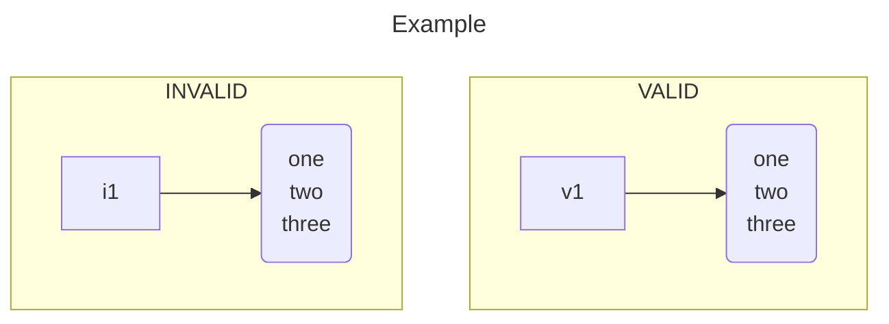

# Mermaid

[[JavaScript]] tool for creating diagramming/charting in [[Markdown]] documents.

[Documentation](https://mermaid.js.org/intro/)

## GitHub

Supported in [[GitHub]] documents.

### Caveats

Multiline node labels _must_ be wrapped in double quotes (`"`).

